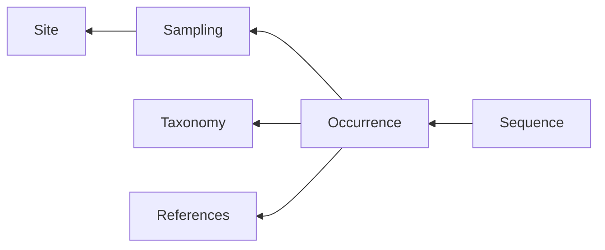

# Dataset guidelines

To put things in context, here is the most simplified representation of the way occurrences are modelled in the database.

A minimal occurrence definition is the reported presence of at least one specimen identified as part of a taxon, at a geospatial coordinate (site), at a given date.
One may include some supporting data for the occurrence, such as literature references or sequences.

The provided dataset template allows filling each of these components.
The template allows including a lot of informations about the occurrence, but most of the columns are **optional**.
Stripped to the minimum, an occurrence record may only specify geospatial coordinates and a taxon (we accounted for the eventuality that the sampling date is not always available).
Nonetheless, you are encouraged to provide as much details as possible.

## Dataset template description

In the data import template, columns are regrouped in semantic groups,
identified by their background color.

The formatting of each column headers indicates the level of requirement for data :

- **Bold red** columns are ***required***
- **Bold** columns are *strongly recommended*
- Other columns are optional

See [columns reference](#columns-reference) below for more specific details about these requirements.

> If all occurrences in your dataset are missing data for some of the optional columns,
> feel free to completely remove these columns from the table, so that things are kept tidy while you work on the dataset.

## Columns reference

This table describes and provides guidelines for each column in the dataset import template.
- **Required** columns are signaled with `✳`
- **Strongly recommended** columns are signaled with `⏺`
- `(✳)` and `(⏺)` columns are respectively **required** or **strongly recommended** under certain conditions, which are explicited in the column description.
- Other columns are fully optional.

|                         |     |                                                                                                                                                                                                                                                                                                                                                      |
| ----------------------- | --- | ---------------------------------------------------------------------------------------------------------------------------------------------------------------------------------------------------------------------------------------------------------------------------------------------------------------------------------------------------- |
| **column**              |     | **description**                                                                                                                                                                                                                                                                                                                                      |
| site_code               |     | An arbitrary identifier for the sampling site. If omitted, a site code will be generated during import. Only alphanumeric characters allowed, including `_`, `-`.                                                                                                                                                                                    |
| latitude                | ✳   | WGS84 decimal latitude, with arbitrary floating precision, e.g. `45.12` or `45.1234`                                                                                                                                                                                                                                                                 |
| longitude               | ✳   | WGS84 decimal longitude, with arbitrary floating precison, e.g. `5.12` or `5.1234`                                                                                                                                                                                                                                                                   |
| coord_precision         | ⏺   | The radius around the provided coordinates where the site may actually be. **Should** be one of : `<100m`, `<1km`, `<10km`, `10-100km`, though if you are using a different granularity we can work with that.                                                                                                                                       |
| altitude                |     | Site altitude in meters (can be negative).                                                                                                                                                                                                                                                                                                           |
| country                 |     | Three letters country code according to [ISO 3166-1 alpha-3](https://en.wikipedia.org/wiki/ISO_3166-1_alpha-3). If omitted, country will be automatically derived from site coordinates.                                                                                                                                                             |
| locality                |     | Nearest locality from the site location. If omitted, will be automatically inferred from coordinates using reverse-geocoding.                                                                                                                                                                                                                        |
| sampling_date           | ⏺   | Date at which the occurrence was collected. Precision might be day (format: `YYYY-MM-DD`), month (`YYYY-MM`) or year (`YYYY`)                                                                                                                                                                                                                        |
| sampling_participants   |     | List of persons involved in collecting the occurrence, in the format: `last name, first name \| last name, first name`. `first_name` might be omitted, or just initials.                                                                                                                                                                             |
| sampling_methods        |     | List of sampling methods involved in collecting the occurrence. List separator: `\|`. See [available terms](#sampling-methods-reference) list, which can be extended as need with you own.                                                                                                                                                           |
| sampling_fixatives      |     | List of conservation methods used to preserve specimens after sampling. List separator: `\|`. See [available terms](#sampling-fixatives-reference) list, which can be extended as needed with your own.                                                                                                                                              |
| sampling_target         |     | List of taxon names that were targeted by the sampling effort. Leave empty if unknown. Designated taxa may be of any taxonomic rank, to describe sampling targets that may have different levels of specificity. For example, `Animalia` may be used to qualify a sampling targetting a very broad spectrum.                                         |
| habitat                 | ⏺   | List of habitat keywords that characterize the targeted sampling habitat at the site. Usable terms are defined on [this diagram](https://app.eraser.io/workspace/GVREfsbcXA55WNxNbphA?origin=share), which can be extended as needed.                                                                                                                |
| access_points           | ⏺   | Comma-separated list of access points that qualify the kind of elements at the site that were sampled. Please reuse [existing terms](#access-points-reference) when applicable. Referencing new terms is perfectly fine, just make sure to be consistent in their usage across the dataset (i.e. please avoid introducing hundreds of new terms).    |
| sampling_id             |     | An arbitrary identifier for the sampling event, to be used **ONLY IF** multiple occurrences were obtained from the same sampling event. In that case, the sampling details must be provided only for the first occurrence, and may be omitted for all the others which should just repeat the `sampling_id`.                                         |
| taxon_name              | ✳   | Identified taxon name of the occurrence. Taxa referenced in GBIF backbone taxonomy should be in binomial notation. Temporary assignation or affinity based identification (aff.) should be specified in whole (e.g. `Asellidae gen. G1 sp. X1`, `Proasellus aff. cavaticus`) and their taxonomic metadata must be provided in the dedicated columns. |
| taxon_rank              | ✳   | Rank of the identified taxon. One of: `Family`, `Genus`, `Subgenus`, `Species`, `Subspecies`.                                                                                                                                                                                                                                                        |
| Family                  | ✳   | Taxonomic *family* to which belongs the identified taxon.                                                                                                                                                                                                                                                                                            |
| Genus                   | (✳) | Taxonomic *genus* to which belongs the identified taxon. Can be omitted if `taxon_rank` is genus or below.                                                                                                                                                                                                                                           |
| Species                 | (✳) | Taxonomic *species* to which belongs the identified taxon. Can be omitted if `taxon_rank` is species or below.                                                                                                                                                                                                                                       |
| tax_id_confer           |     | `true` if identification is uncertain (cf.). Leave empty otherwise.                                                                                                                                                                                                                                                                                  |
| tax_id_addendum         |     | Optional suffix used to refine the identification below the subspecies level, e.g. `form A`, `group X`...                                                                                                                                                                                                                                            |
| identified_on_date      |     | Date at which the occurrence was identified. Precision might be day (format: `YYYY-MM-DD`), month (`YYYY-MM`) or year (`YYYY`)                                                                                                                                                                                                                       |
| identified_by           |     | A single person responsible for the identification. Format: `last name, first name`, where `first name` is optional and can be initials.                                                                                                                                                                                                             |
| specimen_quantity       |     | Approximation of the quantity of specimens that were sampled. Must be one of: `One`, `Several`, `Ten`, `Tens`, `Hundred`                                                                                                                                                                                                                             |
| content_description     |     | Further description of the bundle of sampled specimens. Might be **any relevant details**, like the exact number or the male/female repartition.                                                                                                                                                                                                     |
| type_status             |     | If provided, must be one of `Holotype` (is the historical reference material for the description of a species), `Neotype` (new reference material to replace an unavailable holotype), `Topotype` (material sampled from the type location of a species). Leave empty if none of them applies.                                                       |
| data_repositories       |     |                                                                                                                                                                                                                                                                                                                                                      |
| DOI                     | ⏺   | The preferable way to reference a publication. Providing a DOI allows fetching the most detailed informations for a literature reference. DOI format should look like `10.1126/science.ads8140`. See also the [literature guidelines](#literature-references-guidelines).                                                                            |
| pub_authors             |     | List of publication authors. List separator: `\|`. Long list of authors may be omitted using `et al.` notation, but will result in a loss of information. Another reason why providing a DOI instead is preferable.                                                                                                                                  |
| pub_year                |     | Publication year of the literature reference, e.g. `2024`.                                                                                                                                                                                                                                                                                           |
| pub_title               |     | Publication title, e.g. `EU needs groundwater ecosystems guidelines`                                                                                                                                                                                                                                                                                 |
| pub_journal             |     | Name of the journal where the article was published, e.g. `Science`                                                                                                                                                                                                                                                                                  |
| pub_verbatim            |     | Full reference for the article, e.g. : `Tiziana Di Lorenzo et al., EU needs groundwater ecosystems guidelines. Science386, 1103-1103(2024)`. **Required** in the absence of a provided DOI.                                                                                                                                                          |
| gene                    | (✳) | **Required** when describing a sequence based occurrence. The initial genes registry includes `16S` (16S RNA), `28S` (28S RNA) and `COI` (Cytochrome oxydase). Feel free to reference other genes, they will be incorporated to the registry when importing the dataset.                                                                             |
| seq_specimen_identifier | (⏺) | **Strongly recommended** if the record defines a sequence. Any arbitrary string is allowed. In the case of sequences deposited in NCBI Genbank, this is the equivalent of the `isolate` field.                                                                                                                                                       |
| accession_number        | (⏺) | NCBI accession number if the sequence was retrieved from or deposited in Genbank, e.g. `OR112654`                                                                                                                                                                                                                                                    |
| MOTU                    |     | An arbitrary MOTU (Molecular Operational Taxonomic Unit) identifier, to which the occurrence is assigned.                                                                                                                                                                                                                                            |

## Sampling guidelines

### Sampling methods reference

The protocol by which the occurrence was obtained.
Terms below are those already in use in the database, which you can reuse.
Feel free to reference new terms in the occurrence dataset as needed,
they will be added to the sampling methods registry.

Remember this is an optional field, we expect that in mose cases this information is not available.

`Bait trap`,
`Bou-Rouch pump`,
`Dredging`,
`Drift filtering`,
`Karaman-Chappuis probe`,
`Phreatobiological net`,
`Pumping`,
`Roots washing`,
`Sight`,
`Surber net`,
`Trap`

### Sampling fixatives reference

The conservation method

`Alcohol`,
`Cryo-conservation`,
`Formaldehyde`,
`None`,
`Other`,
`RNA Later`,
`Silica`

### Habitats reference

Habitats qualify the environment that was targetted during sampling.
They are a list of terms picked from a predefined hierarchical structure defined [here](https://app.eraser.io/workspace/GVREfsbcXA55WNxNbphA?origin=share).

### Access points reference

  `aqueduct`,
  `artificial cavity`,
  `artificial gallery`,
  `bog`,
  `canal`,
  `cave`,
  `cistern`,
  `drip`,
  `fountain`,
  `gour`,
  `hyporheic zone`,
  `hypothelminorheic habitat`,
  `lake`,
  `marsh`,
  `mine`,
  `mosses`,
  `peat`,
  `pond`,
  `quarry`,
  `river`,
  `sea`,
  `siphon`,
  `spring`,
  `stream`,
  `travertine`,
  `tunnel`,
  `wash house`,
  `water catchment`,
  `well`

## Taxonomy guidelines

When importing a dataset with occurrences from a new taxonomic group,
the internal taxonomy in the database is first seeded with the relevant parts of the [GBIF backbone taxonomy](https://www.gbif.org/dataset/d7dddbf4-2cf0-4f39-9b2a-bb099caae36c).

### Temporary taxon assignment

Sometimes, an occurrence can not be assigned to a known, previously described, taxon.
There are two ways by which we can handle this situation :

- Identify as an anonymous taxon, which has affinity to a known referenced taxon, e.g. `Proasellus aff. escolai`
- Assign a temporary name to the new unclassified taxonomic group. Examples :
  - Temporary genus: `Asellidae gen. X` (Asellidae is the parent family)
  - Temporary species: `Proasellus sp. S1` (temporary species in the genus Proasellus, named S1)
  - Temporary subspecies: `Stenasellus virei subsp. A` (temporary subspecies named A in the species *Stenasellus virei*)
  - `Asellidae gen. X sp. S1` (temporary species of a new genus in the Asellidae family)

### About rank subgenus
Although GBIF backbone taxonomy does not include taxa on the subgenus level,
our database model allows recording occurrences of taxa having subgenus rank.
**This rank is not used to organize species, only to identify occurrences where the most accurate identification points to a subgenus.**
Please avoid including the subgenus when identifying a species (**no** assignments like `Asellus (Asellus) aquaticus`).

A subgenus occurrence **must** have `taxon_rank` column: `Subgenus` and `taxon_name` in a format like `Genus (Subgenus)`, e.g: `Graeteriella (Paragraeteriella)`.

## Literature references guidelines

**Always prefer directly providing a DOI** when referencing a published article,
as that will allow fetching the most detailed informations about the reference.

Otherwise please provide at minimum the **verbatim reference**, the list of **authors** (comma-separated), and the **year**.
Publication title and name of the journal are also nice to have, but can be omitted it is too much of a hassle.
